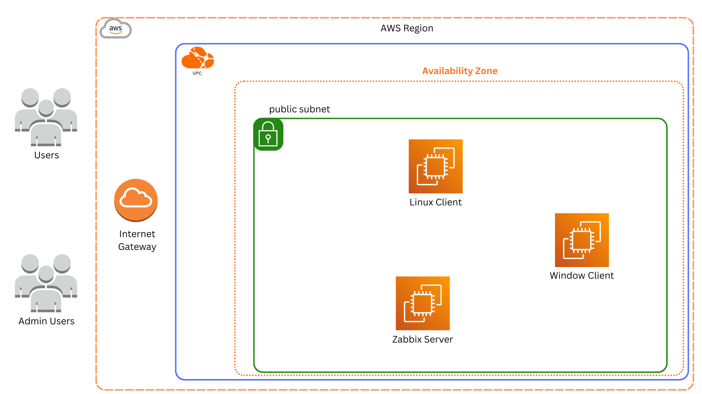
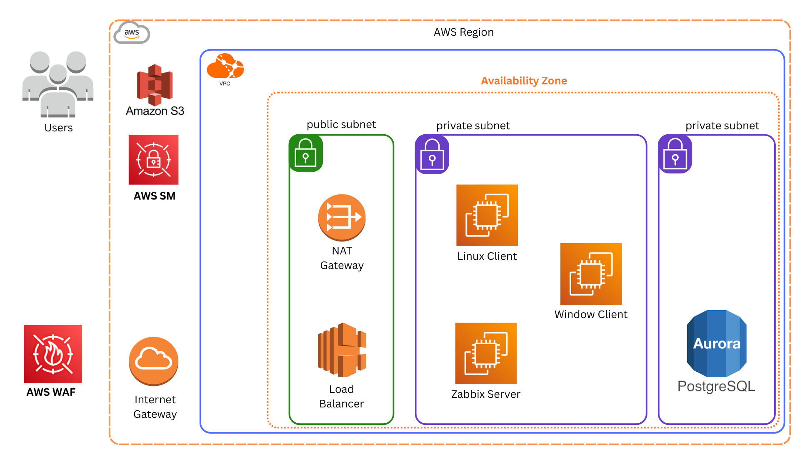

# AWS Zabbix Monitoring Infrastructure


A complete, production-ready Zabbix monitoring infrastructure deployment on AWS with full network configuration examples, automated installation scripts, and comprehensive documentation.

## Table of Contents

- [Overview](#overview)
- [Features](#features)
- [Architecture](#architecture)
- [Prerequisites](#prerequisites)
- [Quick Start](#quick-start)
- [Project Structure](#project-structure)
- [Configuration Details](#configuration-details)
- [Security Considerations](#security-considerations)
- [Troubleshooting](#troubleshooting)
- [Contributing](#contributing)
- [License](#license)

## Overview

This repository contains a complete AWS infrastructure setup for deploying a Zabbix monitoring system. It includes:

- **VPC Configuration**: Complete network architecture with subnets, route tables, internet gateway, and security groups
- **Zabbix Server**: Dockerized Zabbix 6.4 with PostgreSQL backend
- **Monitoring Agents**: Installation scripts and configurations for both Linux and Windows clients
- **AWS Resource Configs**: Exported JSON configurations for all AWS resources for easy replication

Perfect for learning, labs, or as a starting point for production deployments.

## Features

- **Complete AWS Infrastructure**: VPC, subnet, IGW, route tables, security groups
- **Automated Installation**: Shell scripts for one-command deployment
- **Docker-based Zabbix**: Easy to deploy and maintain
- **Multi-OS Support**: Linux (Ubuntu) and Windows Server agents
- **Security Best Practices**: Least-privilege security group rules
- **Comprehensive Documentation**: Every component fully documented
- **Export/Import Ready**: All AWS configurations exported as JSON


## Architecture

This repository includes two architecture designs:

### Lab/Learning Architecture (Current Implementation)



**Key Features:**
- Single public subnet for simplicity
- All instances with public IPs for easy access
- Direct internet access via Internet Gateway
- Perfect for learning and testing

**Components:**

1. **Zabbix Server** (t3.large, Ubuntu 22.04)
   - Dockerized Zabbix 6.4 with PostgreSQL
   - Web interface (HTTP/HTTPS)
   - Zabbix Server (Port 10051)

2. **Linux Client** (t3.medium, Ubuntu 22.04)
   - Zabbix Agent 2
   - Monitored by Zabbix Server

3. **Windows Client** (t3.large, Windows Server 2022)
   - Zabbix Agent
   - Monitored by Zabbix Server

---

### Production Architecture (Recommended)



**Enhanced Security & Scalability Features:**

#### Network Architecture
- **Public Subnet**: Contains Load Balancer and NAT Gateway for internet-facing services
- **Private Subnets**: Hosts all application instances (Zabbix Server, monitored clients) with no direct internet access
- **NAT Gateway**: Enables private instances to download updates and patches while remaining secure

#### High Availability Components
- **Application Load Balancer (ALB)**:
  - Distributes traffic to Zabbix web interface
  - Provides SSL/TLS termination
  - Health checks and automatic failover
  - Can scale across multiple Zabbix servers

- **Amazon RDS PostgreSQL**:
  - Managed database service in separate private subnet
  - Automated backups and point-in-time recovery
  - Multi-AZ deployment for high availability
  - Automatic failover and maintenance

#### Security Enhancements
- **AWS Secrets Manager**:
  - Stores database credentials, SSH keys, and API tokens
  - Automatic secret rotation
  - Fine-grained access control via IAM
  - Audit logging of secret access

- **Amazon S3**:
  - Stores Zabbix configuration backups
  - Zabbix exports and report archives
  - Server-side encryption
  - Versioning for recovery

- **AWS WAF (Web Application Firewall)**:
  - Protects Zabbix web interface from common attacks
  - Rate limiting and IP filtering
  - SQL injection and XSS protection
  - Custom security rules

#### Monitoring & Notifications
- **CloudWatch Integration**:
  - EC2 instance metrics (CPU, memory, disk)
  - RDS database performance monitoring
  - Load Balancer health and traffic metrics
  - Custom application metrics

- **SNS (Simple Notification Service)**:
  - Email/SMS alerts for critical events
  - Instance failure notifications
  - Automated monthly monitoring reports
  - Integration with Zabbix alerting

#### Cost Optimization
- **Auto Scaling Groups** (optional):
  - Scale Zabbix proxy servers based on load
  - Automatic replacement of unhealthy instances
  - Scheduled scaling for peak hours

---

## Prerequisites

Before you begin, ensure you have:

- **AWS Account** with appropriate permissions
- **AWS CLI** installed and configured
- **SSH Key Pair** created in your AWS region
- **Basic knowledge** of AWS, Docker, and Linux

### Required Tools

```bash
# AWS CLI
aws --version
```

## Quick Start

### Step 1: Clone the Repository

```bash
git clone https://github.com/taoudi-abdelbasset/aws-zabbix-monitoring-infrastructure.git
cd aws-zabbix-monitoring-infrastructure
```

### Step 2: Review Configuration Files

Before deploying, review and update placeholder values in:
- `aws-infrastructure/vpc-config/*.json` - Replace `XXXXXXXXXXXX`, `X.X.X.X`, etc.
- `agents/linux/install-agent.sh` - Update Zabbix Server IP
- `agents/windows/install-instructions.md` - Update Zabbix Server IP

### Step 3: Deploy AWS Infrastructure

1. **Create VPC and Networking** (via AWS Console or CloudFormation)
   - Use configs in `aws-infrastructure/vpc-config/` as reference
   - VPC CIDR: `10.0.0.0/16`
   - Subnet CIDR: `10.0.1.0/24`

2. **Create Security Groups**
   - Import rules from `aws-infrastructure/vpc-config/security-groups.json`
   - Update `YOUR_PUBLIC_IP` with your actual IP

3. **Launch EC2 Instances**
   - Use configs in `agents/instants-config/` as reference
   - Ubuntu 22.04 for Zabbix Server and Linux Client
   - Windows Server 2022 for Windows Client

### Step 4: Install Zabbix Server

```bash
# SSH into your Zabbix Server instance
ssh -i your-key.pem ubuntu@ZABBIX_SERVER_PUBLIC_IP

# Download and run the installation script
wget https://github.com/taoudi-abdelbasset/aws-zabbix-monitoring-infrastructure/master/zabbix-server/installation-script.sh
chmod +x installation-script.sh
sudo ./installation-script.sh

# Deploy Zabbix with Docker Compose
mkdir ~/zabbix-docker && cd ~/zabbix-docker
wget https://github.com/taoudi-abdelbasset/aws-zabbix-monitoring-infrastructure/master/zabbix-server/docker-compose.yml
docker-compose up -d

# Wait 2-3 minutes for initialization
docker-compose ps
```

Access Zabbix web interface at: `http://ZABBIX_SERVER_PUBLIC_IP`

**Default Credentials:**
- Username: `Admin`
- Password: `zabbix`

### Step 5: Install Agents

#### Linux Agent

```bash
# SSH into Linux client
ssh -i your-key.pem ubuntu@LINUX_CLIENT_PUBLIC_IP

# Download and run the agent installation script
wget https://github.com/taoudi-abdelbasset/aws-zabbix-monitoring-infrastructure/master/agents/linux/install-agent.sh
chmod +x install-agent.sh
sudo ./install-agent.sh ZABBIX_SERVER_PRIVATE_IP Linux-Client-machine
```

#### Windows Agent

Follow the detailed guide in `agents/windows/install-instructions.md`

### Step 6: Add Hosts to Zabbix

1. Login to Zabbix web interface
2. Go to **Configuration → Hosts → Create host**
3. Configure:
   - **Host name**: `Linux-Client-machine` or `Windows-Client-machine`
   - **Groups**: Select appropriate group
   - **Interfaces**: Add agent interface with private IP
   - **Templates**: Select "Linux by Zabbix agent" or "Windows by Zabbix agent"
4. Click **Add**
5. Wait 1-2 minutes and verify ZBX status turns green ✅

## Project Structure

```
aws-zabbix-monitoring-infrastructure/
│
├── agents/                          # Agent configurations and scripts
│   ├── instants-config/            # EC2 instance configurations (JSON)
│   │   ├── all-instances.json
│   │   ├── instance-linux-client-config.json
│   │   ├── instance-windows-client-config.json
│   │   └── instance-zabbix-server-config.json
│   │
│   ├── linux/                       # Linux agent files
│   │   ├── install-agent.sh        # Automated installation script
│   │   └── zabbix_agent2.conf      # Configuration template
│   │
│   └── windows/                     # Windows agent files
│       └── install-instructions.md  # Step-by-step guide
│
├── aws-infrastructure/              # AWS networking configurations
│   ├── infra.md                    # Detailed infrastructure documentation
│   └── vpc-config/                 # VPC resource configurations (JSON)
│       ├── internet-gateways.json
│       ├── network-acls.json
│       ├── route-tables.json
│       ├── security-groups.json
│       ├── subnets.json
│       └── vpc.json
│
├── zabbix-server/                   # Zabbix server deployment
│   ├── docker-compose.yml          # Docker Compose configuration
│   └── installation-script.sh      # Docker installation script
│
├── resources/                       # Additional resources (screenshots, diagrams)
│
├── INSTALLATION.md                  # Detailed installation guide
└── README.md                        # This file
```

## Configuration Details

For complete infrastructure documentation including VPC configuration, security groups, network architecture diagrams, and routing details, see:

**📖 [Complete Infrastructure Documentation](./aws-infrastructure/infra.md)**

This document includes:
- Detailed VPC and subnet configuration
- Security group rules with diagrams
- Network architecture with Mermaid diagrams
- Route table configurations
- EC2 instance specifications
- Network ACL settings
- Monitoring ports reference

### Quick Reference

- **VPC CIDR**: `10.0.0.0/16`
- **Subnet CIDR**: `10.0.1.0/24` (Public)
- **Region**: `us-east-1`
- **Key Ports**: 80/443 (Web), 10051 (Server), 10050 (Agent), 22 (SSH), 3389 (RDP)

## Security Considerations

### Important Security Notes

1. **Replace Placeholder Values**: All configurations use sanitized placeholder values. Replace:
   - `XXXXXXXXXXXX` → Your AWS account ID
   - `X.X.X.X`, `Y.Y.Y.Y`, `Z.Z.Z.Z` → Your actual public IPs
   - `YOUR_PUBLIC_IP` → Your actual public IP address
   - `sg-XXXXXXXXX` → Your actual security group IDs

2. **Restrict SSH/RDP Access**: Only allow access from your specific IP address

3. **Change Default Passwords**:
   - Zabbix web interface (default: Admin/zabbix)
   - PostgreSQL database password in `docker-compose.yml`

4. **Use HTTPS**: Configure SSL/TLS for production deployments

5. **Regular Updates**: Keep Zabbix, agents, and OS packages updated

6. **Private Subnets**: For production, use private subnets with NAT Gateway

7. **IAM Roles**: Use IAM roles instead of access keys where possible

### Production Recommendations

- Use AWS RDS for PostgreSQL instead of containerized database
- Implement backup and disaster recovery strategies
- Use Application Load Balancer for Zabbix web interface
- Deploy across multiple availability zones
- Implement CloudWatch monitoring for AWS resources
- Use AWS Secrets Manager for sensitive credentials

## Additional Resources

- [Official Zabbix Documentation](https://www.zabbix.com/documentation/current/)
- [AWS VPC Documentation](https://docs.aws.amazon.com/vpc/)
- [Docker Documentation](https://docs.docker.com/)
- [Zabbix Community Forum](https://www.zabbix.com/forum/

## License

This project is licensed under the MIT License - see the [LICENSE](LICENSE) file for details.

---

**Note**: This is a learning/lab environment setup. For production deployments, additional security hardening, high availability, and backup strategies should be implemented.