# VPC Configuration Documentation

## Overview
This document describes the Virtual Private Cloud (VPC) configuration for the Zabbix monitoring infrastructure deployed on AWS.

---

## VPC Details

| Parameter | Value |
|-----------|-------|
| **VPC Name** | `Zabbix-VPC` |
| **IPv4 CIDR Block** | `10.0.0.0/16` |
| **IPv6 CIDR Block** | None |
| **Tenancy** | Default |
| **DNS Resolution** | Enabled |
| **DNS Hostnames** | Enabled |
| **Region** | `us-east-1` (N. Virginia) |

---

## Network Architecture Diagram

```mermaid
graph TB
    
    subgraph VPC["VPC: 10.0.0.0/16<br/>Zabbix-VPC"]
        IGW[Internet Gateway<br/>Zabbix-IGW]
        
        subgraph PublicSubnet["Public Subnet: 10.0.1.0/24 Zabbix-Public-Subnet<br/>AZ: us-east-1a"]
            ZabbixServer["🖥️ Zabbix Server<br/>10.0.1.151<br/>Public: Z.Z.Z.Z<br/>t3.large Ubuntu"]
            LinuxClient["🐧 Linux Client<br/>10.0.1.123<br/>Public: X.X.X.X<br/>t3.medium Ubuntu"]
            WindowsClient["🪟 Windows Client<br/>10.0.1.192<br/>Public: Y.Y.Y.Y<br/>t3.large Windows Server"]
        end
        
        RT[Route Table<br/>Zabbix-Public-RT]
    end
    
    Internet -.->|0.0.0.0/0| IGW
    IGW --> PublicSubnet
    RT -.->|Routes Traffic| PublicSubnet
    
    style VPC fill:#e1f5ff,stroke:#0066cc,stroke-width:3px
    style PublicSubnet fill:#fff4e6,stroke:#ff9800,stroke-width:2px
    style ZabbixServer fill:#ffebee,stroke:#f44336,stroke-width:2px
    style LinuxClient fill:#e8f5e9,stroke:#4caf50,stroke-width:2px
    style WindowsClient fill:#e3f2fd,stroke:#2196f3,stroke-width:2px
```

---

## Subnet Configuration

### Public Subnet

| Parameter | Value |
|-----------|-------|
| **Subnet Name** | `Zabbix-Public-Subnet` |
| **Availability Zone** | `us-east-1a` |
| **IPv4 CIDR Block** | `10.0.1.0/24` |
| **Available IPs** | 251 (AWS reserves 5 IPs) |
| **Auto-assign Public IPv4** | Enabled |
| **Auto-assign IPv6** | Disabled |

#### Reserved IP Addresses (AWS)
- `10.0.1.0` - Network address
- `10.0.1.1` - VPC router
- `10.0.1.2` - DNS server
- `10.0.1.3` - Reserved by AWS
- `10.0.1.255` - Network broadcast

---

## Internet Gateway

| Parameter | Value |
|-----------|-------|
| **IGW Name** | `Zabbix-IGW` |
| **State** | Attached |
| **Attached to VPC** | `Zabbix-VPC` |

### Purpose
The Internet Gateway enables communication between instances in the VPC and the internet. It provides:
- Outbound internet access for instances
- Inbound access to instances with public IPs
- NAT for instances with public IPv4 addresses

---

## Route Table Configuration

### Public Route Table

| Parameter | Value |
|-----------|-------|
| **Route Table Name** | `Zabbix-Public-RT` |
| **Associated Subnets** | `Zabbix-Public-Subnet` |

#### Routes

| Destination | Target | Purpose |
|------------|--------|---------|
| `10.0.0.0/16` | local | Internal VPC communication |
| `0.0.0.0/0` | `Zabbix-IGW` | Internet access (all traffic) |

---

## Security Groups

Three security groups were created to control traffic flow:

### 1. SG-Zabbix-Server

| Parameter | Value |
|-----------|-------|
| **Security Group Name** | `zabbix-server-sg` |
| **Description** | Security group for Zabbix monitoring server |
| **VPC** | `Zabbix-VPC` |

#### Inbound Rules

| Type | Protocol | Port Range | Source | Description |
|------|----------|------------|--------|-------------|
| HTTP | TCP | 80 | 0.0.0.0/0 | Zabbix Web Interface |
| HTTPS | TCP | 443 | 0.0.0.0/0 | Zabbix Web Interface SSL |
| Custom TCP | TCP | 10051 | 10.0.0.0/16 | Zabbix Server receives data from agents |
| SSH | TCP | 22 | Your-IP/32 | SSH access |
| All ICMP - IPv4 | ICMP | All | 10.0.0.0/16 | Allow ping from VPC |

#### Outbound Rules

| Type | Protocol | Port Range | Destination | Description |
|------|----------|------------|-------------|-------------|
| All traffic | All | All | 0.0.0.0/0 | Allow all outbound traffic |

---

### 2. SG-Linux-Client

| Parameter | Value |
|-----------|-------|
| **Security Group Name** | `linux-client-sg` |
| **Description** | Security group for Linux monitored client |
| **VPC** | `Zabbix-VPC` |

#### Inbound Rules

| Type | Protocol | Port Range | Source | Description |
|------|----------|------------|--------|-------------|
| Custom TCP | TCP | 10050 | sg-ZABBIX-SERVER-SG | Zabbix Agent port (from Zabbix Server SG) |
| SSH | TCP | 22 | Your-IP/32 | SSH access |
| All ICMP - IPv4 | ICMP | All | 10.0.0.0/16 | Allow ping from VPC |

#### Outbound Rules

| Type | Protocol | Port Range | Destination | Description |
|------|----------|------------|-------------|-------------|
| All traffic | All | All | 0.0.0.0/0 | Allow all outbound traffic |

---

### 3. SG-Windows-Client

| Parameter | Value |
|-----------|-------|
| **Security Group Name** | `windows-client-sg` |
| **Description** | Security group for Windows monitored client |
| **VPC** | `Zabbix-VPC` |

#### Inbound Rules

| Type | Protocol | Port Range | Source | Description |
|------|----------|------------|--------|-------------|
| Custom TCP | TCP | 10050 | sg-ZABBIX-SERVER-SG | Zabbix Agent port (from Zabbix Server SG) |
| RDP | TCP | 3389 | Your-IP/32 | Remote Desktop access |
| All ICMP - IPv4 | ICMP | All | 10.0.0.0/16 | Allow ping from VPC |

#### Outbound Rules

| Type | Protocol | Port Range | Destination | Description |
|------|----------|------------|-------------|-------------|
| All traffic | All | All | 0.0.0.0/0 | Allow all outbound traffic |

---

## Security Group Traffic Flow

---

## Network ACLs

The default Network ACL is used for this VPC with the following configuration:

| Type | Rule # | Protocol | Port Range | Source/Destination | Allow/Deny |
|------|--------|----------|------------|-------------------|------------|
| Inbound | 100 | All | All | 0.0.0.0/0 | Allow |
| Outbound | 100 | All | All | 0.0.0.0/0 | Allow |

> **Note:** Network ACLs are stateless, while Security Groups are stateful. We rely primarily on Security Groups for fine-grained access control.

---

## EC2 Instance IP Allocation

| Instance Name  | Instance Type | Private IP | Public IP | Security Group |
|--------------|---------------|------------|-----------|----------------|
| Zabbix Server | t3.large | 10.0.1.151 | Z.Z.Z.Z | zabbix-server-sg |
| Linux Client | t3.medium | 10.0.1.123 | X.X.X.X | linux-client-sg |
| Windows Client | t3.large | 10.0.1.192 | Y.Y.Y.Y | windows-client-sg |

---

## Network Design Principles

### 1. **Single Public Subnet Architecture**
- Simplified design suitable for lab/learning environment
- All instances in public subnet with public IPs for easy access
- Production environments should use private subnets with NAT Gateway

### 2. **Security Group Strategy**
- **Least Privilege Access**: Only necessary ports are opened
- **Source Restriction**: Zabbix agent ports only accept traffic from Zabbix Server SG
- **Administrative Access**: SSH/RDP restricted to specific IP addresses
- **Inter-Instance Communication**: Uses Security Group references for dynamic updates

### 3. **IP Address Planning**
- VPC CIDR: /16 provides 65,536 addresses
- Subnet CIDR: /24 provides 256 addresses (251 usable)
- Room for expansion with additional subnets if needed

### 4. **High Availability Considerations**
For production, consider:
- Multiple availability zones (us-east-1a, us-east-1b)
- Private subnets with NAT Gateway for backend instances
- Application Load Balancer for Zabbix web interface
- RDS for Zabbix database instead of containerized PostgreSQL

---

## Monitoring Ports Reference

| Service | Port | Protocol | Direction | Purpose |
|---------|------|----------|-----------|---------|
| Zabbix Web UI | 80, 443 | TCP | Inbound | Web interface access |
| Zabbix Server | 10051 | TCP | Inbound | Receives data from agents |
| Zabbix Agent | 10050 | TCP | Inbound | Server polls agent for data |
| SSH (Linux) | 22 | TCP | Inbound | Remote management |
| RDP (Windows) | 3389 | TCP | Inbound | Remote desktop |
| ICMP | - | ICMP | Both | Network diagnostics (ping) |

---

## Notes

- All instances are in the same availability zone (us-east-1a) for simplicity
- Public subnet design chosen for easy access during setup and demonstration
- Security groups use both CIDR blocks and SG references for flexibility
- ICMP enabled for network troubleshooting and connectivity testing

---

## Related Documentation

- [Network Architecture Diagram](../architecture-diagram.png)